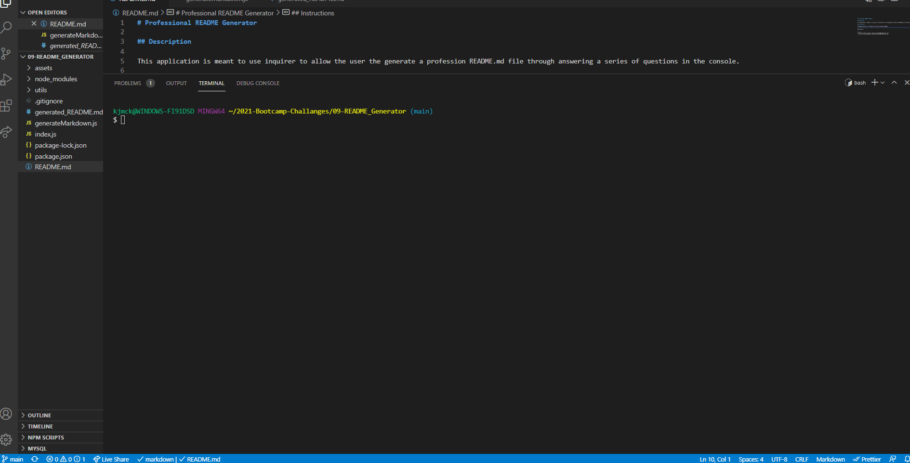

# Professional README Generator

## Description

This application is meant to use inquirer to allow the user the generate a profession README.md file through answering a series of questions in the console.

## Instructions

The application will be invoked by using the following command:

```
node index.js
```
## Demo
The following animations show the web application's appearance and functionality:



## Links
[Github Repo](https://github.com/kjmckinley/README-generator.git)
- Github SSH key: git@github.com:kjmckinley/README-generator.git

## Contributors
- Kyle McKinley - GitHub: kjmckinley
- Ritchie Ortiz - GitHub: xRortiz
